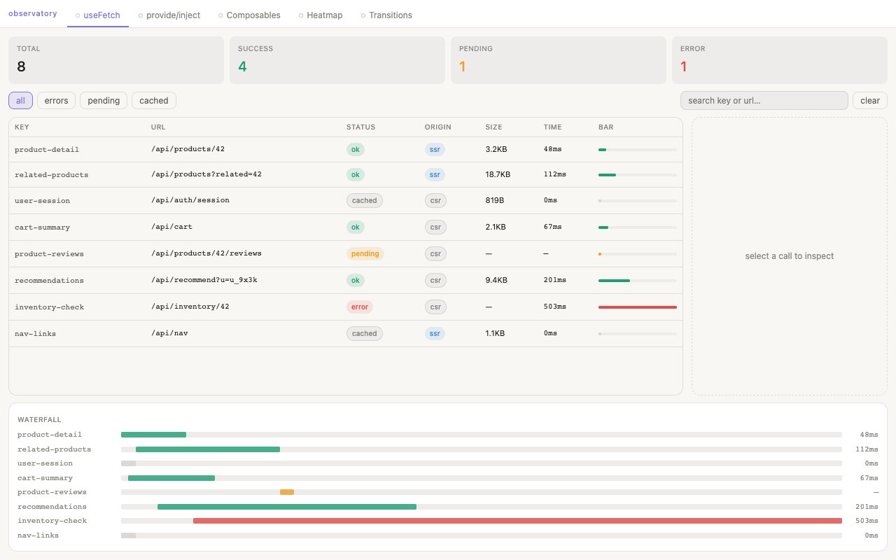
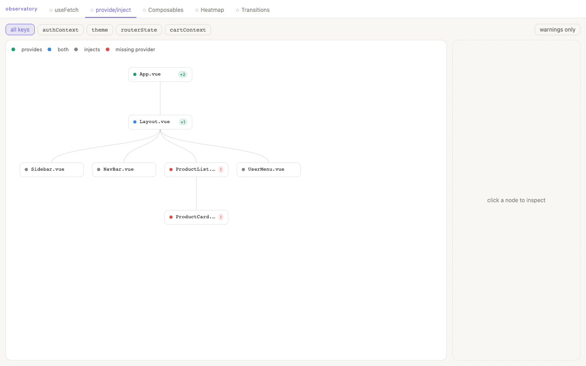
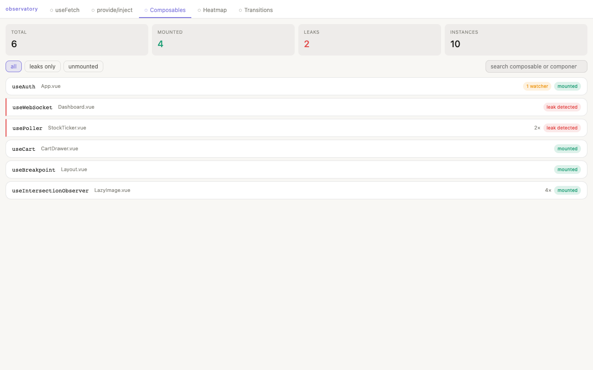
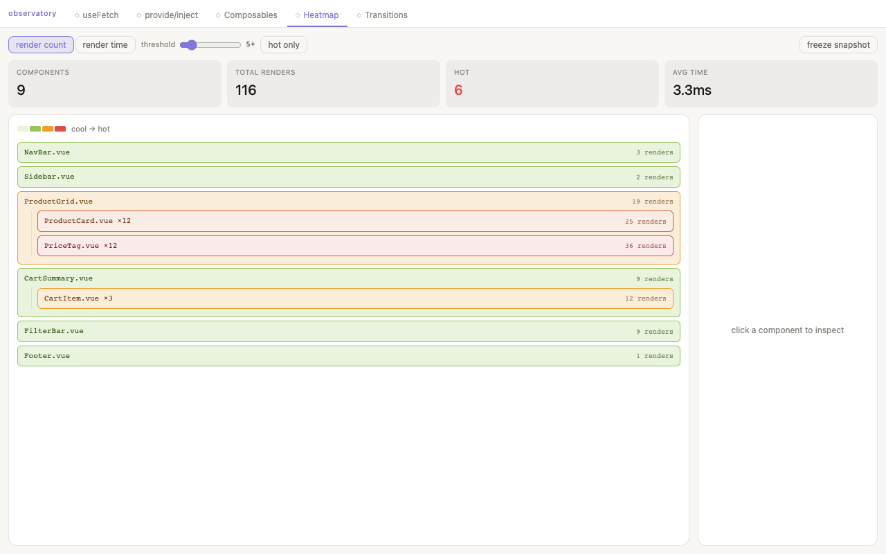
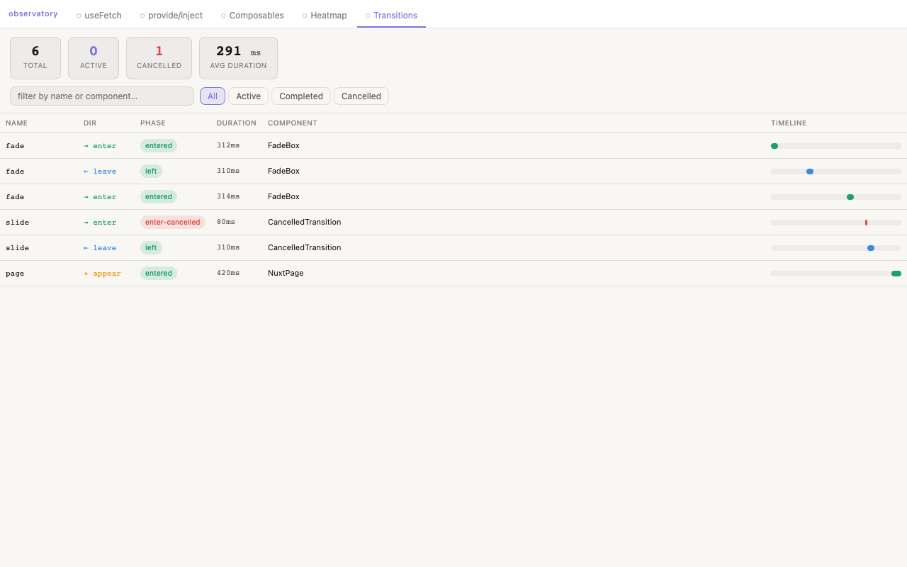

# nuxt-devtools-observatory

Vue/Nuxt DevTools extension providing five missing observability features:

- **useFetch Dashboard** — central view of all async data calls, cache keys, waterfall timeline
- **provide/inject Graph** — interactive tree showing the full injection topology with missing-provider detection
- **Composable Tracker** — live view of active composables, their reactive state, and leak detection
- **Render Heatmap** — component tree colour-coded by render frequency and duration
- **Transition Tracker** — live timeline of every `<Transition>` lifecycle event with phase, duration, and cancellation state

## Installation

```bash
pnpm add nuxt-devtools-observatory
```

```ts
// nuxt.config.ts
export default defineNuxtConfig({
  modules: ['nuxt-devtools-observatory'],

  observatory: {
    fetchDashboard: true,
    provideInjectGraph: true,
    composableTracker: true,
    renderHeatmap: true,
    transitionTracker: true,
    heatmapThreshold: 5,   // highlight components with 5+ renders
  },

  devtools: { enabled: true },
})
```

Open the Nuxt DevTools panel — five new tabs will appear.

The DevTools client SPA runs on a dedicated Vite development server (port **4949**).

## How it works

All instrumentation is **dev-only**. The module registers Vite transforms that wrap
`useFetch`, `provide/inject`, `useX()` composable calls, and `<Transition>` at the
AST/module level before compilation. In production (`import.meta.dev === false`) the
transforms are skipped entirely — zero runtime overhead.

### useFetch Dashboard



A Vite plugin wraps `useFetch` / `useAsyncData` calls with a thin shim that records:

- Key, URL, status, origin (SSR/CSR)
- Payload size and duration
- Start offset for waterfall rendering

A Nitro plugin captures server-side fetch timing independently and tunnels it to the
client over the HMR WebSocket.

### provide/inject Graph



A Vite plugin wraps `provide()` and `inject()` calls with annotated versions that
carry file and line metadata. At runtime, a `findProvider()` function walks
`instance.parent` chains to identify which ancestor provided each key.
Any `inject()` that resolves to `undefined` is flagged immediately.

### Composable Tracker



A Vite plugin detects all `useXxx()` calls matching Vue's naming convention and
wraps them with a tracking proxy that:

1. Temporarily replaces `window.setInterval`/`clearInterval` during setup to capture
   any intervals started inside the composable
2. Wraps `watch()` calls to track whether stop functions are called on unmount
3. Snapshots returned `ref` and `computed` values for the live state panel
4. Flags any watcher or interval still active after `onUnmounted` fires as a **leak**

### Render Heatmap



Uses Vue's built-in `renderTriggered` mixin hook and `app.config.performance = true`.
A `PerformanceObserver` reads Vue's native `vue-component-render-start/end` marks for
accurate duration measurement. Component bounding boxes are captured via `$el.getBoundingClientRect()`
for the DOM overlay mode.

### Transition Tracker



A Vite plugin intercepts `import ... from 'vue'` in user code and serves a virtual
proxy module that overrides the `Transition` export with an instrumented wrapper.
This is necessary because the Vue 3 template compiler generates direct named imports
(`import { Transition as _Transition } from "vue"`) that bypass `app.component()`
entirely.

The wrapper records every lifecycle phase without interfering with Vue's internal
CSS/JS timing detection:

| Hook | Phase recorded |
|---|---|
| `onBeforeEnter` | `entering` |
| `onAfterEnter` | `entered` |
| `onEnterCancelled` | `enter-cancelled` |
| `onBeforeLeave` | `leaving` |
| `onAfterLeave` | `left` |
| `onLeaveCancelled` | `leave-cancelled` |

> `onEnter` / `onLeave` are intentionally **not** wrapped — Vue inspects their
> `.length` property to choose CSS-mode vs JS-mode timing, and wrapping changes
> that length.

The Transitions tab shows a live timeline with name, direction, phase, duration,
parent component, and cancellation state for every transition fired on the page.
Data is bridged from the Nuxt app (port 3000) to the Observatory SPA (port 4949)
via `postMessage` since the two origins are cross-origin inside the DevTools iframe.

## Opting out

Add a `/* @devtools-ignore */` comment before any call to exclude it from instrumentation:

```ts
/* @devtools-ignore */
const { data } = useFetch('/api/sensitive')

/* @devtools-ignore */
const result = useMyComposable()
```

## Development

```bash
# Install dependencies
pnpm install

# Run the playground
pnpm dev

# Run tests
pnpm test

# Build the module (client SPA + Nuxt module)
pnpm build
```

## Architecture

```
src/
├── module.ts                           ← Nuxt module entry — registers transforms, plugins, devtools tabs
├── transforms/
│   ├── fetch-transform.ts              ← AST wraps useFetch/useAsyncData
│   ├── provide-inject-transform.ts     ← AST wraps provide/inject
│   ├── composable-transform.ts         ← AST wraps useX() composables
│   └── transition-transform.ts         ← Virtual vue proxy — overrides Transition export
├── runtime/
│   ├── plugin.ts                       ← Client runtime bootstrap + postMessage bridge
│   └── composables/
│       ├── fetch-registry.ts           ← Fetch tracking store + __devFetch shim
│       ├── provide-inject-registry.ts  ← Injection tracking + __devProvide/__devInject
│       ├── composable-registry.ts      ← Composable tracking + __trackComposable + leak detection
│       ├── render-registry.ts          ← Render performance data via PerformanceObserver
│       └── transition-registry.ts      ← Transition lifecycle store
└── nitro/
    └── fetch-capture.ts                ← SSR-side fetch timing

client/
├── index.html
├── vite.config.ts                      ← Client SPA Vite config (built to client/dist/)
├── tsconfig.json
└── src/
    ├── App.vue                         ← Tab navigation shell
    ├── main.ts
    ├── style.css                       ← Design system
    ├── components/
    ├── stores/
    └── views/
        ├── FetchDashboard.vue          ← useFetch tab UI
        ├── ProvideInjectGraph.vue      ← provide/inject tab UI
        ├── ComposableTracker.vue       ← Composable tab UI
        ├── RenderHeatmap.vue           ← Heatmap tab UI
        └── TransitionTimeline.vue      ← Transition tracker tab UI

playground/
├── app.vue                             ← Demo app exercising all five features
├── nuxt.config.ts
├── composables/
│   ├── useCounter.ts                   ← Clean composable (properly cleaned up)
│   └── useLeakyPoller.ts               ← Intentionally leaky (for demo)
├── components/
│   ├── ThemeConsumer.vue               ← Successfully injects 'theme'
│   ├── MissingProviderConsumer.vue     ← Injects 'cartContext' (no provider — red node)
│   ├── LeakyComponent.vue              ← Mounts useLeakyPoller
│   ├── HeavyList.vue                   ← Re-renders on every shuffle (heatmap demo)
│   ├── PriceDisplay.vue                ← Leaf component with high render count
│   └── transitions/
│       ├── FadeBox.vue                 ← Healthy enter/leave transition
│       ├── BrokenTransition.vue        ← Missing CSS classes (enter fires but stays in entering)
│       └── CancelledTransition.vue     ← Rapid toggle triggers enter-cancelled / leave-cancelled
└── server/api/
    └── product.ts                      ← Mock API endpoint
```

## License

MIT
